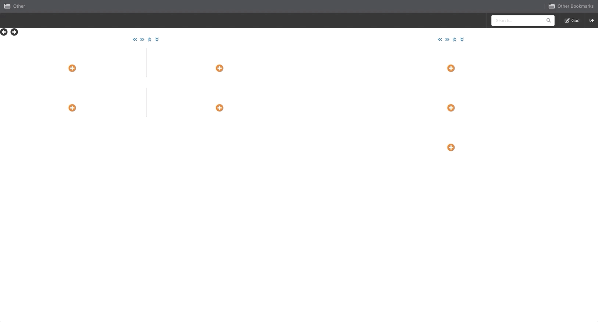
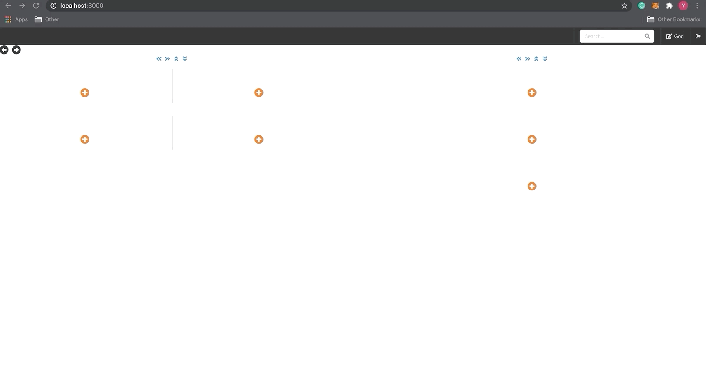

## Project Goal

Design and implement an interface for a user to buy oTokens (options) on an AMM (automated market maker)

### Application Description

- Users first need to install the MetaMask extension
- After install the extension, in one of the grid, select "MetaMask"
- The connect MetaMask
- Find another grid to either do Swap, Invest

### Installation

npm install

### Run Program

npm start

### Application Demos

### Contact Info

yimeng.yu@gmail.com
